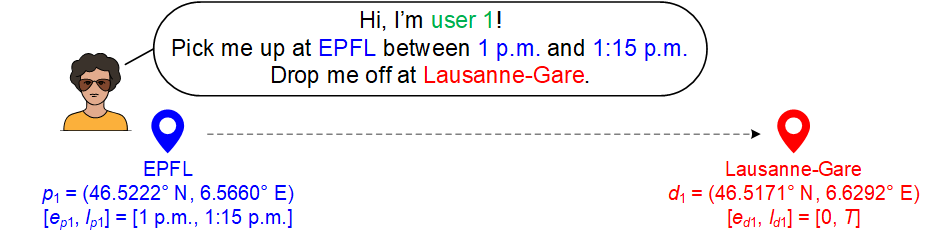

# The Transformer Network for the Dial-a-Ride Problem

<div align="center">
<p>

</p>
</div>


## Introduction

In this project, we introduce a Transformer-based learning framework for the Dial-a-Ride Problem (DARP), a pickup and delivery transportation problem that has traditionally been solved using mixed integer programming. The Transformer, a neural network architecture originally developed for natural language processing, is adapted to the DARP and trained through supervised learning and reinforcement learning. Decoding is done using greedy sampling and beam search. We report the performance gap compared to, a recent Gurobi-based solver. Our results reinforce the recent trend, that deep learning techniques may be able to learn better heuristics for combinatorial problems than human-engineered approaches and that the Transformer architecture may be a promising tool for tackling NP-hard problems in the industry.


## Configuration

To reproduce our results:

- Install the following packages.
  - [torch](https://pytorch.org/)\>=1.12.1
  - numpy\>=1.23.1
  - matplotlib\>=3.5.2

- Clone the repository: `git clone https://github.com/aygong/DARP.git`
- Run the script:  `main.py`


## Arguments

The arguments in `main.py` is explained as follows.

- The arguments related to `dataset.py`

  - `--dataset`: Enable `dataset.py `

  - `--train_index`: Set the type of training instances for supervised learning

  - `--num_sl_subsets`: Set the number of training subsets to be generated

  - `--num_sl_instances`: Set the number of training instances for generating each training subset

  - `--wait_time`: Set the wait time (time units)

- The arguments related to `supervision.py`

  - `--supervision`: Enable `supervision.py`

  - `--batch_size`: Set the batch size

  - `--epochs`: Set the number of epochs

- The arguments related to `reinforcement.py`

  - `--reinforcement`: Enable `reinforcement.py`

  - `--num_rl_instances`: Set the number of training instances for reinforcement learning

- The arguments related to `evaluation.py`

  - `--evaluation`: Enable `evaluation.py`

  - `--model_type`: Set the model type

  - `--test_index`: Set the type of test instances

  - `--num_tt_instances`: Set the number of test instances

  - `beam`: Set the parameter of beam search

- The arguments related to `transformer.py` are referred to [here](https://arxiv.org/pdf/1706.03762.pdf).


## Folder Structure

```
./DARP/
├── README.md
|
├── main.py                    # Start execution
├── utils.py                   # Collect small useful functions
├── environment.py             # Define simulators
├── transformer.py             # Define transformers
├── dataset.py                 # Generate training subsets
├── supervision.py             # Implement supervised learning
├── reinforcement.py           # Implement reinforcement learning
├── evaluation.py              # Evaluate trained models
|
├── dataset/                   # Contain training subsets
├── instance/                  # Contain training instances
├── model/                     # Contain trained models
└── result/                    # Contain training logs and results
```
